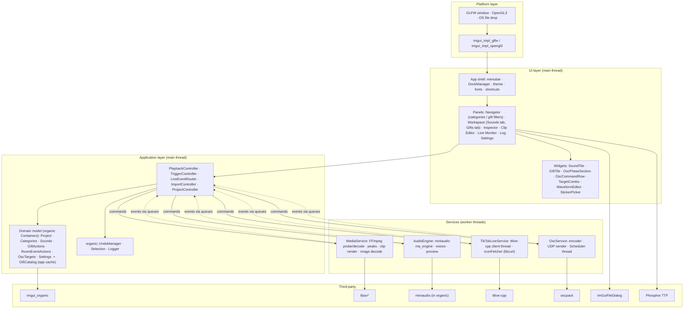
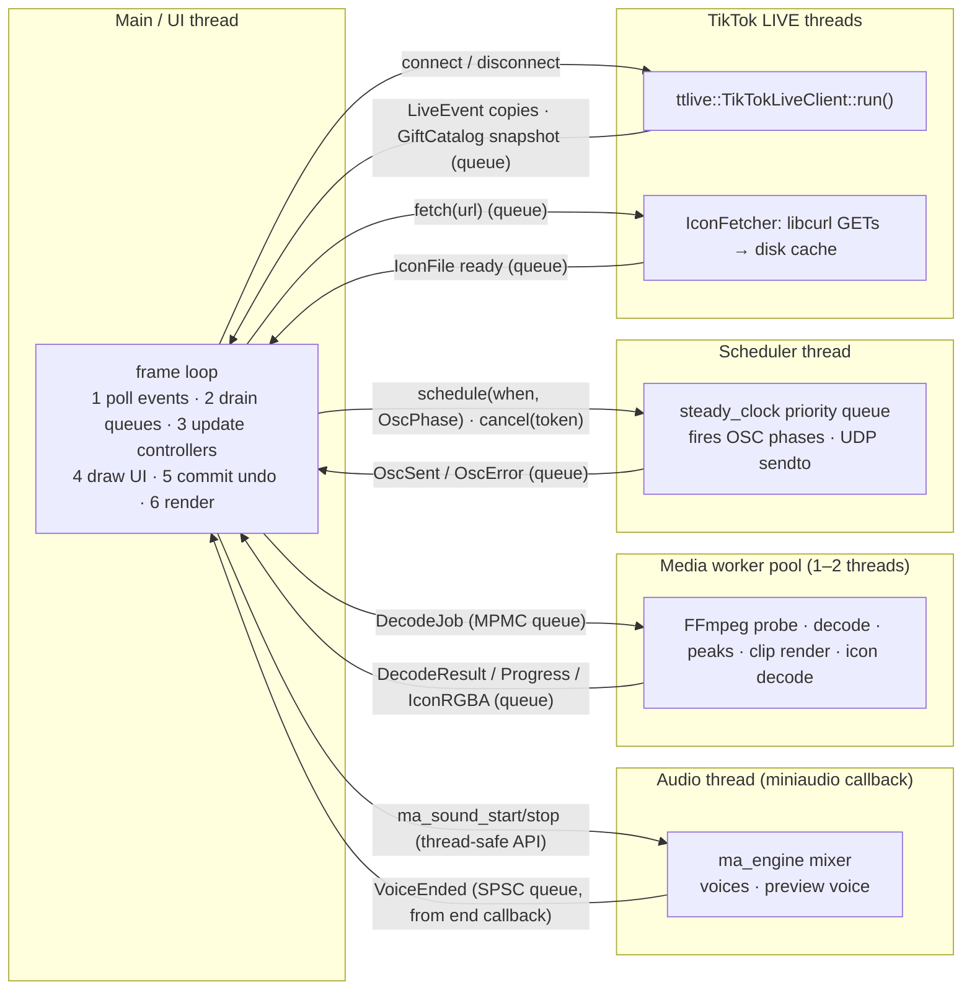
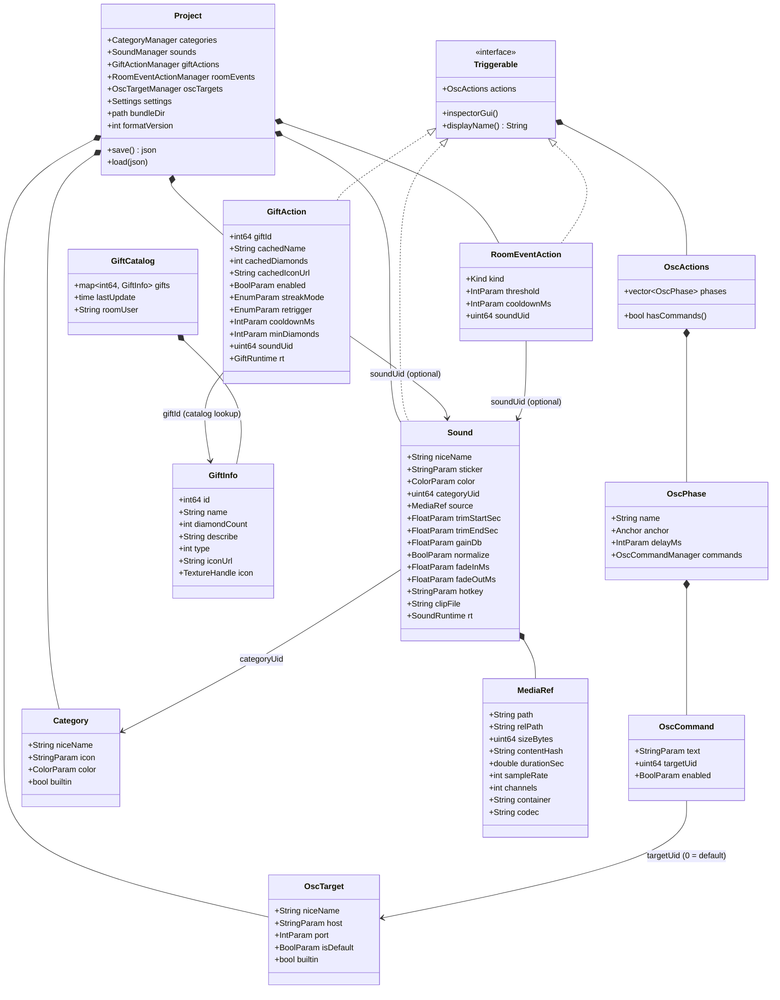
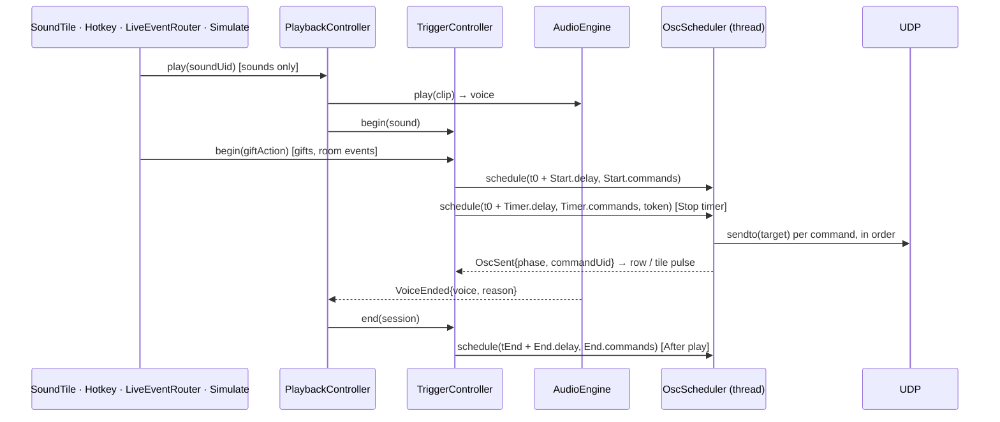
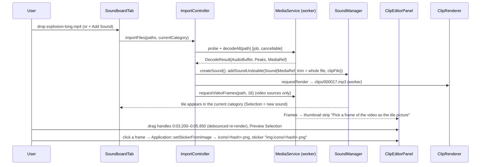
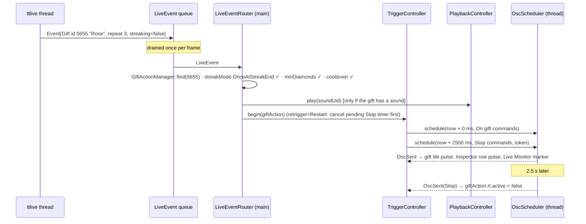

# EvoMusicBox — Software Architecture

Companion to [`UI.md`](UI.md) (the UI/UX specification). `UI.md` says what the
application must *feel* like; this document says how it is *built*: modules,
threads, data flow, third‑party integration, build system and the order in
which to implement it.

The product is a **soundboard + lightweight clip trimmer + OSC trigger
launcher**, extended with a **TikTok LIVE gift gallery** (the `ttlive-cpp`
library in `third_party/`), built as a single‑window C++17 desktop application
on **Dear ImGui (docking)**, **imgui_organic** and **FFmpeg**.

Two structural ideas extend `UI.md`:

- The **center workspace has tabs**: *Sounds* (the tile grid of `UI.md`) and
  *Gifts* (the gallery of the TikTok room's gift catalog). A gift is a tile like
  a sound is a tile.
- The **right sidebar is a generic Inspector**: whatever is selected — a sound
  tile, a gift, a room event — the Inspector shows *that object's* OSC actions
  (targets, commands, timing). For a sound the timing is *at play / after play*;
  for a gift it is *on gift / stop after a timer*. "No matter what we click, we
  can set the OSC on it."

---

## 0. Executive summary

| Concern | Decision |
|---|---|
| Language / standard | C++17 (imgui_organic and ttlive-cpp both require it) |
| Windowing / GPU | GLFW 3.3+ + OpenGL 3 via the ImGui backends in `third_party/imgui/backends` (multi‑viewport capable, OS file‑drop callback) |
| UI framework | Dear ImGui **docking branch** + ImPlot (pulled by imgui_organic) |
| Application framework | `imgui_organic` — used for its **model layer** (`Parameter`/`Container`/`BaseItem`/`BaseManager`), **undo/redo**, **selection**, **JSON persistence**, **DockManager**, **Logger**, audio helpers (`AudioBuffer`, `Peaks`, `AudioCache`, WAV I/O). Its timeline editor and sequence audio engine are **not** used. |
| Icons | Phosphor (`third_party/web`) TTF merged into the UI font (PUA U+E000–U+EE83); also the default *sticker* library |
| File dialogs | `ImGuiFileDialog` (v0.6.9 WIP) |
| Media decoding | **FFmpeg libraries** (`libavformat`/`libavcodec`/`libswresample`/`libavutil`, ≥ 6.0) in a worker thread; also injected as `organic::AudioCache::decodeFallback` |
| Audio output | **miniaudio** high‑level engine (`ma_engine`/`ma_sound`) — already compiled inside `organic` (0.11.25); the app owns the one and only device |
| OSC | Sending only (v1). Small vendored OSC 1.0 encoder + UDP socket (recommended: **oscpack**; alternative: tinyosc). Commands are scheduled by a dedicated steady‑clock scheduler thread |
| OSC actions model | One reusable component, `OscActions` = ordered **phases** (`Start`, `End`, `Timer` anchors) each holding a delay and a list of commands. Sounds own {At play, After play}; gifts own {On gift, Stop (timer)}. Any `Inspectable` can carry an `OscActions` and gets the same editor in the Inspector |
| Inspector | The right sidebar is a generic **Inspector** following the main `organic::Selection`: it draws `inspectorGui()` of whatever is selected (sound, gift, room event). OSC Targets (address book) sit at its top, then the object's phases |
| TikTok LIVE | `ttlive-cpp` wrapped in a service thread; the room's **gift catalog** (`gift_list()`) becomes the *Gifts* tab (icons fetched with the curl‑impersonate libcurl that ttlive already links, decoded with FFmpeg); each gift may own OSC actions (+ optionally a sound); live events are routed to those actions |
| Persistence | Show file **`<name>.liv`** = one zip (miniz) of the project bundle: `project.json` (nlohmann/json via organic `save()/load()`), rendered `clips/*.mp3` (MP3 via libavcodec/libmp3lame; shows of earlier versions hold float32 `clips/*.wav`, converted on load), picture stickers `icons/*.png` — never the source media. Opened by extracting into a working folder (`Project::bundleDir`) in the cache dir; the legacy **bundle folder** `<name>.evobox/` (+ optional `media/` copies) is still read and written. App prefs + layouts in the user config dir |
| Build | Single top‑level CMake superbuild; every dependency in `third_party/` is consumed as a subdirectory / source list; FFmpeg, GLFW, OpenGL, protobuf, zlib, OpenSSL from the system (pkg‑config / vcpkg / brew) |

**Two facts discovered while inventorying `third_party/` that gate everything:**

1. `third_party/imgui` is checked out on **`master`** (1.93.0 WIP, `IMGUI_VERSION_NUM 19297`). It has **no docking**. `imgui_organic` hard‑fails at configure time without the docking branch. The clone already contains `remotes/origin/docking`; **check it out** (organic's known‑good commit `9b4eb24` is present locally; docking HEAD `3bae66c` is the same 1.93.0 WIP version). See §9.2.
2. `third_party/ttlive-cpp/third_party/quickjs` is an **empty submodule** — `git submodule update --init --recursive` must be run inside `third_party/ttlive-cpp` before it builds. It also downloads `curl-impersonate` at configure time unless `CURL_IMPERSONATE_LOCAL_DIR` is set.

---

## 1. Third‑party inventory and roles

Everything present in `third_party/` is used. Versions/facts below were read from the checked‑out sources.

| Library | Location | Version / state | Role in EvoMusicBox | License |
|---|---|---|---|---|
| **Dear ImGui** | `third_party/imgui` | 1.93.0 WIP (19297), branch `master` → **must become `docking`** | Immediate‑mode UI, docking, multi‑viewports, backends `imgui_impl_glfw` + `imgui_impl_opengl3`, `misc/cpp/imgui_stdlib`, optional `misc/freetype` | MIT |
| **imgui_organic** | `third_party/imgui_organic` | commit `665c85e` ("Timeline v2 hosts…"); submodules populated: ImPlot (v1.0 API), nlohmann/json 3.12.0, miniaudio 0.11.25 | Model layer, undo, selection, dock manager, logger, JSON persistence, audio buffers/peaks/WAV, `AudioCache` with `decodeFallback` hook | *no license file yet* (README says add one before publishing) |
| **ImGuiFileDialog** | `third_party/ImGuiFileDialog` | `IGFD_VERSION "v0.6.9 WIP"`, declares ImGui 1.92.3 support (only version gate is `PushFont` ≥ 19201 — fine with 1.93) | "+ Add Sound" file picker, Open/Save project | MIT |
| **ttlive-cpp** | `third_party/ttlive-cpp` | HEAD `86b6da7`; QuickJS submodule **empty**; needs protobuf+protoc, zlib, OpenSSL (declared, unused), curl‑impersonate (downloaded) | Read‑only TikTok LIVE client: comments, gifts, likes, joins, follows, shares, subscribes, viewer counts, stream URLs | **none** (all rights reserved by default); bundles proprietary ByteDance JS in `js/` |
| **Phosphor Icons (web)** | `third_party/web` | `@phosphor-icons/web` 2.1.2; TTF/WOFF/WOFF2 per weight (regular, thin, light, bold, fill, duotone); `core/` submodule empty (not needed) | UI icon font + curated sticker set; `style.css`/`selection.json` are the machine‑readable name→codepoint maps | MIT |

Transitively provided by imgui_organic (no extra checkout needed): **ImPlot** (MIT), **nlohmann/json** (MIT), **miniaudio** (public domain / MIT‑0).

**Added by this architecture** (permissively licensed, small):

| Library | Why |
|---|---|
| **FFmpeg libs** (system: `libavformat 61 / libavcodec 61 / libavutil 59 / libswresample 5 / libswscale 8` on the dev machine = FFmpeg 7.1) | Decode *any* media (audio files, video containers) to float PCM; decode gift icons (**WebP**/PNG → RGBA via `libavcodec` + `libswscale`, stb_image cannot read WebP). LGPL‑2.1+ → link **dynamically** |
| **libcurl** — *not a new dependency*: the `curl_impersonate::curl_impersonate` imported target created by ttlive-cpp's CMake is `GLOBAL` with `INTERFACE_INCLUDE_DIRECTORIES`, explicitly meant for parent projects | HTTPS download of gift icons (`GiftInfo::icon_url`, `Event::gift_icon_url`) on a worker thread; only when `EVOBOX_WITH_TIKTOK` |
| **oscpack** (vendored into `third_party/oscpack`) — or `tinyosc` | OSC 1.0 message/bundle encoding + cross‑platform UDP transmit socket |
| **doctest** or **Catch2** (single header) | Headless unit tests for parser/model/scheduler |
| **GLFW 3.4** (system) | Window, input, `glfwSetDropCallback` for OS drag & drop |

Dev machine check (Ubuntu, GCC 14.2 / Clang, CMake 3.31, Ninja): FFmpeg 7.1 libs, GLFW 3.4, protobuf 3.21.12 + `protoc`, OpenSSL 3.4, zlib 1.3.1, FreeType 26.2 present. SDL3 is not installed (SDL2 is) — one more reason GLFW is the default backend.

---

## 2. Architectural drivers (from `UI.md`)

| Driver | Consequence |
|---|---|
| *Speed / live usability*: "press the tile to trigger" must be instantaneous and never block | Clips are pre‑decoded in RAM; playback command reaches the audio callback without locks; **no** file I/O, decoding or network on the UI thread |
| *Immediate feedback* on playback, OSC sends, selection, waveform changes | Every asynchronous subsystem reports back through per‑frame drained queues; UI reads only main‑thread state |
| *Single window, four areas, flexible proportions*, future *performance mode* | `organic::DockManager` with four default zones; performance mode = a saved layout + panel visibility |
| *Avoid dialogs*, edit everything in place | Model objects are `organic::Container`s; every widget writes through undoable setters — no modal "apply" step |
| *Undo everywhere* (implicit in a fast editor) | All mutations go through `organic::UndoManager`; continuous gestures coalesce into one step |
| *Media type does not matter after import* | FFmpeg is the universal decoder; the model only ever sees `AudioBuffer` (float, interleaved) |
| *OSC targets = address book*, per‑command target, at‑play / after‑play delays, Localhost default | `OscTarget` items with a non‑removable Localhost; commands reference targets by uid; a steady‑clock scheduler fires groups relative to playback start/end |
| *Future*: overlapping/exclusive playback, negative delays, hotkeys, OSC test button, list view, tile sizes | Playback policy is a strategy object; the scheduler accepts negative offsets by delaying the voice start; tiles have a free `hotkey` field; view mode is a panel setting |
| *"No matter what we click, we can set the OSC on it"* | OSC configuration is a **component** (`OscActions`) not a sound feature; the right sidebar is a **generic Inspector** driven by the selection; every selectable model object is an `organic::Inspectable` with an `inspectorGui()` |
| *TikTok gifts as first‑class tiles* (from `third_party/ttlive-cpp`) | The gift catalog is a browsable **Gifts tab** in the center; a gift's OSC is *On gift* + *Stop after N ms* (a timer, since a gift has no playback length); live gift events route to those actions through the same `TriggerController` that sounds use; a **Simulate** button exercises the identical path without a live stream |

---

## 3. System overview



**Dependency rule:** `ui → app → model → organic`; `app → services`; services never include UI headers and never touch the model directly. Services communicate **only** through thread‑safe queues and immutable shared data (`std::shared_ptr<const AudioBuffer>`).

---

## 4. Process and threading model



Rules:

1. **The model is owned by the main thread.** Only the main thread reads or writes `organic::Container`s, undo stacks, selection, ImGui state.
2. **Cross‑thread data is immutable or copied.** Decoded audio lives in `std::shared_ptr<const organic::AudioBuffer>`; workers produce, main publishes into the model, the audio engine holds a reference for as long as a voice plays.
3. **Queues, not callbacks, cross thread boundaries.** Each service exposes `post(Command)` (any thread → service) and `drain(std::function<void(const Event&)>)` (main thread, once per frame). Implementation: mutex + `std::deque` for low‑rate channels; a lock‑free SPSC ring for the audio → main channel.
4. **The audio callback never blocks or allocates.** `ma_engine`'s public `ma_sound_*` calls are designed to be issued from a control thread; voice buffers are pre‑allocated; end‑of‑sound notifications are pushed to the SPSC ring from the end callback.
5. **Timing‑critical OSC** is fired by the scheduler thread (≈ sub‑millisecond jitter), not by the ~16 ms UI frame.
6. **ttlive-cpp callbacks run on its own thread** (`run()` blocks; callbacks are invoked on the calling thread, or on an internal poller thread in dual mode). They are copied into a queue and nothing else — no model access, no ImGui, no `fetch_gift_list()` while `run()` is live (not thread‑safe with it). The gift catalog is read inside the `Connect` callback (`client.gift_list()` after `fetch_gift_list = true`) and posted to the main thread as one immutable snapshot.
7. **GPU textures are created on the main thread only.** Icon bytes are downloaded (IconFetcher thread) and decoded to RGBA (media pool); the main thread uploads them (`glTexImage2D`) when it drains the result — ImGui/OpenGL contexts are not shared with workers.

---

## 5. Domain model

All model classes derive from `organic::Container` (parameters, change notification, JSON) or `organic::BaseItem`/`BaseManager` (uid, factory, undoable add/remove/duplicate/move, clipboard). **Views are custom** (`ManagerListUI`/`ManagerCanvasUI` are developer‑grade and don't match the design language); the organic *model* is what we reuse. Every selectable object is an `organic::Inspectable` and implements `inspectorGui()` — that is what makes the right sidebar generic.



Field notes: `XxxParam` = an `organic::Parameter*` created with `addString/addFloat/addInt/addBool/addEnum/addColor` (undoable, inspectable, serialized). `sticker`/`icon` strings use a scheme prefix: `ph:rocket` (Phosphor glyph, tinted with the item colour), `emoji:🚀` (only with `EVOBOX_WITH_EMOJI`), `img:<file>` (reserved). `clipFile` is bundle‑relative (`clips/000042.mp3`; shows of earlier versions: `.wav`). `rt` fields are runtime‑only (§5.3).

### 5.1 `OscActions` — the reusable OSC component

`OscActions` is an `organic::Container` child owned by any *triggerable* object. It holds an ordered list of **phases**; each phase is a `Container` with a name, an **anchor**, a delay and its own `OscCommandManager` (a `BaseManager` of `OscCommand` rows → undoable add/remove/reorder/duplicate and clipboard for free).

| Anchor | Fires at | Used by |
|---|---|---|
| `Start` | `t0 + delayMs`, where `t0` is the trigger instant (tile pressed, gift received, room event) | Sound "At play (start)", Gift "On gift", room events "On event" |
| `End` | `tEnd + delayMs`, where `tEnd` is reported later by the owner (playback finished or stopped) | Sound "After play" |
| `Timer` | `t0 + delayMs` but **restartable/cancellable** while pending — this is the "stop timer" | Gift "Stop", room events "Stop" (e.g. `/light/flash 0` 3 s after the gift) |

The owner decides the phase set in its constructor (the UI never invents phases):

```cpp
Sound::Sound()      { actions.addPhase("At play (start)", Anchor::Start, 0);
                      actions.addPhase("After play",      Anchor::End,   0); }
GiftAction::GiftAction() { actions.addPhase("On gift", Anchor::Start, 0);
                           actions.addPhase("Stop",    Anchor::Timer, 3000); }   // "when to send the OSC to stop"
```

`UI.md` §17–§21 describe exactly the Sound phase set; gifts reuse the same rows, headers and target combos, only the timing label differs ("Stop  3 000 ms" reads as *send these commands 3 s after the gift*). Negative delays (§17) stay representable as a later option on `Start`.

### 5.2 Managers, ordering, invariants

- `SoundManager : organic::BaseManager` holds **one global ordered list**. A category view is a filter over it; drag‑reordering inside a category calls `undoableMove(indexOf(dragged), indexOf(dropTarget))` on the global list, which preserves the relative order of every other item.
- `CategoryManager` seeds the defaults from `UI.md` §4 (Music, Effects, Voices, Ambient, Interface, Custom) with `builtin = true` (renamable/reorderable, deletable only if empty — "All Sounds" is a virtual entry, not an item).
- `GiftActionManager` holds one `GiftAction` per gift **that the user has configured** — never one per catalog entry (catalogs have hundreds of gifts). Selecting a gift in the gallery selects its `GiftAction` if it exists, otherwise a **transient, unsaved** `GiftAction` is shown; the first edit turns it into a real item through `undoableAdd` (so an untouched gift leaves no trace in the project). `cachedName/cachedDiamonds/cachedIconUrl` are copied from the catalog so a project opened without the catalog (offline, other machine) still displays properly.
- `RoomEventActionManager` holds exactly five fixed items (`Like`, `Follow`, `Share`, `Subscribe`, `Join`), created at project creation, `userCanRemove = false`. They are the "other things we can click" in the Gifts tab navigator. `threshold` = likes per fire for `Like` (ignored otherwise).
- `OscTargetManager` always contains **Localhost 127.0.0.1** (`builtin`, `userCanRemove = false`, default unless another target is flagged default). Exactly one target is default at any time (`onItemsChanged()` repairs the invariant).
- Cross references are **uids** (stable `uint64` persisted by `BaseItem`) or TikTok gift ids (`int64`), never pointers or names. A deleted target leaves commands pointing to `0` → "Localhost (default)"; a deleted category moves its sounds to "Custom" (one undo step); a deleted sound clears `soundUid` on gift/room actions referencing it.
- `GiftCatalog` is **not project data**: it is an app‑level cache (§7.6) merged from every `Connect` (`gift_list()`) and from gift events (`gift_id`, `gift_name`, `diamond_count`, `gift_icon_url` of gifts absent from the list). The gallery shows the catalog; the project stores only actions.

### 5.3 Runtime state (never serialized)

- `Sound::rt` — `playing`, `voiceHandle`, `progress01`, `lastOscPulseTime`, `mediaStatus` (Ok / SourceMissing / ClipMissing / Decoding), `std::shared_ptr<const AudioBuffer> clip` (rendered clip, preloaded), `std::shared_ptr<const MediaAsset> sourceAsset` (lazy, for editing).
- `GiftAction::rt` — `active` (Start fired, Timer pending), `stopToken` (scheduler token for restart/cancel), `lastFireTime`, `pendingStreakCount`, `receivedCount`, `lastPulseTime` (gallery tile feedback).
- `GiftInfo::icon` — `TextureHandle` (GL texture id + size) created on the main thread from decoded RGBA; `IconState` (NotRequested / Fetching / Ready / Failed).

### 5.4 Selection

`organic::Selection::get()` (main scope) holds **the** selected inspectable (`UI.md` §34) — a `Sound`, a `GiftAction` (real or transient), or a `RoomEventAction`. The Inspector reads `Selection::get().items` every frame; a tile draws its selected state from `Inspectable::isSelected()`. Categories and gift filters are navigation, not inspectables (plain `selectedCategoryUid` / `giftFilter` in the navigator state). Switching workspace tab does not clear the selection; the Inspector simply keeps showing the last selected object.

---

## 6. UI layer

### 6.1 Shell and layout

```cpp
organic::DockManager dock;
dock.addPanel("Navigator",    DockZone::Left,   [&](bool* o){ navigatorPanel.draw(o);   });  // categories (Sounds tab) / gift filters + room events (Gifts tab)
dock.addPanel("Workspace",    DockZone::Center, [&](bool* o){ workspacePanel.draw(o);   });  // ImGui tab bar: Sounds | Gifts
dock.addPanel("Inspector",    DockZone::Right,  [&](bool* o){ inspectorPanel.draw(o);   });  // OSC targets + phases of the selected object
dock.addPanel("Clip Editor",  DockZone::Bottom, [&](bool* o){ clipEditorPanel.draw(o);  });  // waveform / trim (sounds)
dock.addPanel("Live Monitor", DockZone::Bottom, [&](bool* o){ liveMonitorPanel.draw(o); }, /*defaultOpen*/ false); // event feed + phase timeline (gifts)
dock.addPanel("Log",          DockZone::Bottom, [&](bool* o){ organic::LoggerPanel(o);   }, false);
```

```text
┌──────────────┬──────────────────────────────────────────┬────────────────────┐
│ Navigator    │ Workspace   [ Sounds ] [ Gifts ]          │ Inspector          │
│              │                                          │                    │
│ Sounds tab:  │  Sounds: category header · search ·      │  ┌ selected object │
│  All Sounds  │          tile grid (UI.md §5–§11)        │  │ 🎁 Rose  1 💎    │
│  Music       │                                          │  │ [Simulate]       │
│  Effects …   │  Gifts:  @user [Connect] ● 94 viewers    │  ├ OSC Targets      │
│              │          search · sort · 312 gifts       │  │ ● Localhost …    │
│ Gifts tab:   │          ┌────┐ ┌────┐ ┌────┐ ┌────┐     │  ├ On gift    0 ms  │
│  All gifts   │          │🌹 1│ │🦁 5k│ │🚀 1k│ │🍩 10│    │  │ /light/flash 1 ▾ │
│  Configured  │          └────┘ └────┘ └────┘ └────┘     │  ├ Stop    3000 ms  │
│  1–99 💎 …   │                                          │  │ /light/flash 0 ▾ │
│  Room events │                                          │  └ streak · cooldown│
├──────────────┴──────────────────────────────────────────┴────────────────────┤
│ Clip Editor (sound selected)      |  Live Monitor (gift selected)             │
│ waveform · handles · preview      |  phase timeline · event feed · Simulate   │
└──────────────────────────────────────────────────────────────────────────────┘
```

- **Workspace tabs.** `WorkspacePanel` draws an `ImGui::BeginTabBar("workspace")` with *Sounds* (`SoundboardTab`, the grid of `UI.md` §5–§11) and *Gifts* (`GiftGalleryTab`, §6.4; only compiled with `EVOBOX_WITH_TIKTOK`). The active tab is persisted in prefs. The **Navigator** follows the active tab: categories for *Sounds*, gift filters + the five room events for *Gifts*. The **Inspector** does not care which tab is active — it follows the selection (§5.4).
- **Bottom zone.** "Clip Editor" and "Live Monitor" share the bottom dock node as tabs. On selection change the shell focuses the relevant one (`ImGui::SetWindowFocus("Clip Editor")` when a sound is selected, `"Live Monitor"` when a gift/room event is selected); the user can still pin either.

- Default proportions: `DockManager::buildDefaultLayout` splits bottom 0.24, left 0.19, right 0.30 (of the remainder) → roughly 19 / 57 / 24 % with a 24 % bottom panel — inside the tolerances of `UI.md` §2 (15 / 60 / 25 %, bottom 25–35 %). If the exact spec ratios are wanted, the additive `setDefaultSplitRatios` knob in §8 is the clean way; until then the app can re‑split the dockspace with `ImGui::DockBuilder*` once after the first `preNewFrame()`.
- **Performance mode** (`UI.md` §42): `F11` / menu toggles a saved layout `layouts/performance.ini` in which only "Workspace" is open (Sounds tab, large tiles), plus `ImGuiDockNodeFlags_NoDockingSplit | NoUndocking` on the dockspace to prevent accidental rearranging during a show. Leaving performance mode restores the previous layout (`dock.requestLoadLayout("editing")`). Layout files are managed by `DockManager` (`saveLayoutToFile`, `requestLoadLayout`, `listLayouts`, `viewMenu`).
- Menubar: File (New / Open / Recent / Merge show… / Save / Save As / Import media…), Edit (Undo / Redo / Duplicate / Delete / Stop All), View (`dock.viewMenu()`, `dock.panelsMenu()`, Performance Mode, Tile size), Live (Connect / Disconnect, username, Refresh gift catalog, Simulate selected), Help.
- **Theme** (`ui/Theme.*`): one function applies the dark charcoal/navy palette, 8 px rounding, subtle borders, and exposes named colors (`Accent`, `AccentGlow`, `TileBg`, `TileBgHover`, `Playing`, `Danger`, …) used by all custom drawing. Style is applied once at startup and on DPI change.
- **Fonts** (`ui/Fonts.*`): UI font (Roboto‑Medium from `imgui/misc/fonts`, or a bundled Inter) at 16 px + a large size for tile stickers; **Phosphor Regular** and **Phosphor Fill** merged (`ImFontConfig::MergeMode`) into each UI font. ImGui ≥ 1.92 loads glyphs on demand, so no glyph‑range tables are required. Icon codepoints come from a **generated header** `IconsPhosphor.h` (`#define ICON_PH_PLAY "\xEE\x8F\x90"` for U+E3D0, `ICON_MIN_PH 0xE000`, `ICON_MAX_PH 0xEE83`) produced by `tools/gen_phosphor_icons.py` from `third_party/web/src/regular/style.css` (regex `\.ph\.ph-([a-z0-9-]+):before\s*\{\s*content:\s*"\\([0-9a-f]{4})"`). Codepoints are identical across weights; duotone uses codepoint (background, α 0.2) and codepoint + 1 (foreground) and is not needed.
- Optional **emoji stickers**: `misc/freetype/imgui_freetype.cpp` with `ImGuiFreeTypeBuilderFlags_LoadColor` and `IMGUI_USE_WCHAR32` can rasterize a colour emoji font (e.g. Noto Color Emoji, present on the dev machine). This is a build option (`EVOBOX_WITH_EMOJI`), not a v1 requirement — Phosphor stickers tinted with the tile colour satisfy `UI.md` §32 ("Simple icons, emojis, or a curated sticker library").
- **Shortcuts** (`ui/Shortcuts.*`), evaluated once per frame when `!io.WantTextInput` via `ImGui::Shortcut`/`IsKeyChordPressed`: Space play/stop selected, Enter play, Delete → confirm, Ctrl+F focus search, Ctrl+D duplicate, arrows move selection in grid, Ctrl+Z / Ctrl+Shift+Z, Ctrl+S, F11 performance mode, **Esc = Stop All** (panic). `DockManager::shortcuts()` supplies Ctrl+1..9 layouts.
- **OS drag & drop**: `glfwSetDropCallback` stores `{paths, mousePos}` in `FileDropQueue`. On the next frame each drop zone (Soundboard body, "Add Sound" tile, a Category row) checks `drop.pos ∈ zoneRect` and claims the drop → `ImportController::importFiles(paths, targetCategoryUid)`. Limitation: GLFW has no drag‑*hover* event, so the "drop media here" affordance is static (the empty state text and the Add Sound tile). If live hover feedback becomes a must, `imgui_impl_sdl3` + SDL3's `SDL_EVENT_DROP_POSITION` is the drop‑in alternative.

### 6.2 Panels and widgets — traceability to `UI.md`

| `UI.md` | Component | Built on |
|---|---|---|
| §2 four areas | `Navigator` (left) · `Workspace` (center, tabs *Sounds* / *Gifts*) · `Inspector` (right) · `Clip Editor` / `Live Monitor` (bottom) | `DockManager` zones |
| §4 Categories, §35 drop tiles on categories | `NavigatorPanel` in *Sounds* mode = `CategoriesList` — vertical list, inline "+ Add Category" editor (name/icon/colour), rename on double‑click, context menu, DnD target for `EVOBOX_SOUND` payloads, drag‑reorder | `CategoryManager` (undoable ops), navigator state |
| §5 header, search, view toggle, Add Sound | `SoundboardTab::header()` — category name, "N clips", `InputTextWithHint` filter (instant, case‑insensitive on name), Grid/List toggle, `+ Add Sound` → `ImGuiFileDialog` (multi‑select, filter "Audio & video{.wav,.mp3,.flac,.ogg,.aiff,.m4a,.aac,.mp4,.mov,.mkv,.webm},.*") | `IGFD::FileDialog::Instance()->OpenDialog/Display/GetSelection` |
| §6 Add media (button / drop anywhere / drop on Add tile), §11 empty state | `SoundboardTab::body()` — drop zone; `AddSoundTile`; empty state text | `FileDropQueue`, `ImportController` |
| §7–§10 Tile design, states, interaction, context actions | `SoundTile` widget — sticker (Phosphor glyph tinted / emoji), name, duration, states: normal / hover / selected (accent glow) / playing (animated ring + progress arc) / missing media (dimmed, warning glyph). Body click = **select**; explicit ▶ button = **play** (`UI.md` §9 recommended behaviour); right‑click context menu (Play, Edit Clip, Rename, Change Sticker, Move to Category ▸, Duplicate, Delete) | `ImDrawList` custom drawing, `Selection`, `PlaybackController`, `SoundManager` undoable ops |
| §36 Reorder tiles, §35 move to category | ImGui DnD payload `EVOBOX_SOUND {uint64 uid}` from a tile; drop on another tile = reorder, drop on category row = reassign | `undoableMove`, `UndoManager::perform` |
| §37 Grid / List views, §38 tile sizes | `SoundboardTab` view mode; list view is an `ImGui::BeginTable` (name, category, duration, #OSC, targets); tile size enum Compact/Standard/Large (Large default in performance mode) | panel settings persisted in prefs |
| §12–§22 OSC panel → **Inspector** | `InspectorPanel` — (1) header card of the selected object (sound: sticker · name · duration · category combo; gift: icon · name · 💎 diamonds · id · **Simulate** ▶; room event: kind icon · name · threshold); (2) `OscTargetsSection` (rows: default radio, name, host, edit ▸ small popup editor with Name / IP / Port / Set default / Delete) — global, always at the top as in §14; (3) one `OscPhaseSection` per phase of the object's `OscActions`: header `name · delay/timer field (ms) · + Add OSC command`, rows `OscCommandRow` = text field · `TargetCombo` (saved target names, default = "Localhost") · ×; (4) object‑specific extras (gift: streak mode, retrigger policy, cooldown, min diamonds, "Also play sound" combo). Send feedback = row background pulse ~300 ms from `OscSent` events (§22, no popups); optional "Test" ▶ per command (§46). Empty state: "Select a sound or a gift" | `Inspectable::inspectorGui()` per model type, `OscTargetManager`, `OscCommandManager`, `DrawParamWidget`/`UndoableInputText`, `OscService`, `Selection` |
| *(new)* Gifts tab | `GiftGalleryTab` — header: `@username` field · Connect/Disconnect · state dot (Disconnected / Connecting / Connected · N viewers / Ended / Error) · catalog count + "updated 12 min ago" · Refresh · search · sort (name / diamonds / configured first). Body: grid of `GiftTile` (icon texture, name, 💎 count, "streak" mark for `type == 1`, **badge with the number of OSC commands** when configured, live **pulse** when received, selected glow). Click = select → Inspector shows the gift's actions (transient until first edit). Context menu: Simulate, Copy actions / Paste actions, Clear actions, Assign sound ▸. Empty state: "Connect to a live room once to load its gift catalog" | `GiftCatalog`, `GiftActionManager`, `TikTokLiveService`, `IconFetcher`, `Selection` |
| *(new)* Navigator in Gifts mode | filters: All gifts · Configured · Received this session · tiers (1–99 💎 / 100–999 / 1000+) and the **Room events** list (Like, Follow, Share, Subscribe, Join) — clicking a room event selects its `RoomEventAction` in the Inspector | navigator state, `RoomEventActionManager` |
| *(new)* Live Monitor (bottom, gifts) | left: **phase timeline** of the selected gift/room event (`|On gift 0 ms| ─────── |Stop 3 000 ms|`, live marker while active, drag the Stop marker = edit the timer); right: live event feed (gift / like / comment / join / follow …, last 200, filterable), viewers, Simulate selected. | `TriggerController` state, `LiveEventRouter` feed |
| §23–§32 Clip editor | `ClipEditorPanel` — `MediaInfoBar` (file name, duration, rate, channels), `TransportBar` (▶ ■ −Zoom +Zoom Fit Normalize + "Loop selection" toggle + "▶ Preview Selection"), `WaveformEditor` widget (peaks, timeline labels, playhead, accent‑highlighted selection, two draggable handles with generous hit areas, Ctrl+wheel zoom at mouse, drag to pan, double‑click to fit), `TrimFields` (Start / End editable `m:ss.mmm`, Duration computed), `ClipDetailsForm` (name, `StickerPicker`, category combo) and `Cancel / Save Clip` | `organic::Peaks::build/query`, `organic::formatTime`, `PreviewPlayer`, `ImportController`/`ClipRenderer` |
| §33 Editing existing clips | Selecting a tile loads its source lazily (worker) and shows its trim region; edits update the same `Sound` unless "Duplicate" | `MediaService`, `Sound` params (undoable), re‑render clip on Save |
| §39 Keyboard | `Shortcuts` | ImGui shortcut routing |
| §40 Multiple playback | `PlaybackPolicy` strategy: **MusicExclusive** default (a music stops the playing music, incl. its own earlier voice), Overlap, StopOthers; per‑sound **Effect** flag (`Sound::isEffectP`): effects always overlap and stack (press 3× = 3 voices), `toggle` re‑fires them | `PlaybackController` |
| §41 Dialogs only for: target editor, sticker picker, destructive confirmation | `SmallPopup` helpers (`BeginPopupModal` with theme) | ImGui |
| §42 Performance mode | layout + lock (see 6.1) | `DockManager` |
| Logging | `organic::LoggerPanel` (OSC sends, decode errors, live connection) | `OLOG/OLOGW/OLOGE` |

`WaveformEditor` is deliberately written with **no app dependencies** (input: `const Peaks&`, duration, `Selection{start,end}`, playhead, view `{t0, pixelsPerSecond}`; output: change flags) so it can later be upstreamed into imgui_organic (§8). The same holds for `OscPhaseSection`/`OscCommandRow`: they take an `OscPhase&` and the target manager, nothing else, so the Inspector can render any triggerable.

### 6.3 The Inspector contract

```cpp
// Every selectable model object implements organic::Inspectable::inspectorGui().
// The panel itself is ~20 lines:
void InspectorPanel::draw(bool* open) {
    ImGui::Begin("Inspector", open);
    auto& sel = organic::Selection::get();
    if (sel.items.empty())            { EmptyState("Select a sound or a gift"); }
    else if (sel.items.size() == 1)   { sel.items[0]->inspectorGui(); }
    else                              { MultiInspector(sel.items); }    // homogeneous multi-edit (later)
    ImGui::End();
}

// Sound / GiftAction / RoomEventAction share one helper for the OSC part:
void DrawOscActionsEditor(Triggerable& t, OscTargetManager& targets) {
    OscTargetsSection(targets);                       // UI.md §14–§16
    for (auto& phase : t.actions.phases) OscPhaseSection(*phase, targets);   // §17–§21 rows, delay/timer field
}
```

Selecting anything anywhere (tile grid, gift gallery, room‑event list, list view, future OSC‑in/hotkeys) goes through `Selection::get().set(obj)`; the Inspector never knows *where* the click came from. Adding a new triggerable type = a model class with an `OscActions` member and an `inspectorGui()` that calls `DrawOscActionsEditor`.

### 6.4 Gifts tab — behaviour details

- **Catalog source.** `GiftCatalog` is filled from `ttlive::TikTokLiveClient::gift_list()` inside the `Connect` callback (options `fetch_gift_list = true`), merged by gift id into the app cache (§7.6) and posted to the main thread. Gifts that appear in events but not in the list are added from `Event` fields (`gift_id`, `gift_name`, `diamond_count`, `gift_type`, `gift_icon_url`). "Refresh" reconnects (the library offers no thread‑safe on‑demand fetch while connected — see §7.5).
- **Icons.** `GiftInfo::iconUrl` is the *first* URL of TikTok's `icon.url_list`, which is frequently **WebP**. `IconFetcher` downloads it (libcurl, disk cache `<cache>/gift-icons/<sha1(url)>`), `MediaService` decodes bytes → RGBA with `libavcodec` (`webp`/`png` decoders via `image2` demuxer) + `libswscale`, the main thread uploads a GL texture. Failures fall back to a Phosphor `gift` glyph. Thumbnails are requested lazily for visible tiles only (`ImGui::IsRectVisible`).
- **Selection → Inspector.** Clicking a tile: `GiftAction* a = giftActions.find(giftId)`; if none, the tab keeps one `transientAction` (owned by the tab, `giftId` set, phases default) and selects it. `TransientGuard`: when any parameter of the transient changes (`onParamChanged`/`onChildParamChanged`) or a command is added, the tab performs `undoableAdd` of a real item seeded from the transient and re‑selects it. Undoing that add returns to a transient state — the gallery never shows stale "configured" badges.
- **Live feedback.** `LiveEventRouter` bumps `GiftAction::rt.lastPulseTime` / `GiftInfo` receive counters; tiles pulse for ~600 ms and the "Received this session" filter uses the counters.
- **Simulate.** Header button, tile context item and Inspector button all call `LiveEventRouter::inject(LiveEvent::syntheticGift(giftId, repeat=1, streaking=false))`, so testing exercises the identical code path as a real event (§7.5).
- **Without TikTok support** (`EVOBOX_WITH_TIKTOK=OFF`): the Gifts tab is not compiled; the navigator has no gift mode; projects containing gift actions still load (actions are plain data) and the Inspector can still edit them via the list view of a "Gift actions (n)" entry in the navigator — nothing is lost, only the gallery and the live connection.

### 6.5 Frame loop

Startup order: GLFW window → `ImGui::CreateContext()` + `ImPlot::CreateContext()` (organic links ImPlot and its debug Inspector/Detective panels draw with it — creating the context is cheap and avoids a crash if a debug panel is opened) → `io.ConfigFlags |= DockingEnable | ViewportsEnable | NavEnableKeyboard` → backends → theme + fonts → `organic::AudioCache::get().decodeFallback = FFmpeg…` → services (`AudioEngine::init`, media pool, scheduler, icon fetcher) → prefs + gift catalog cache + last project → dock panels.

```cpp
while (!glfwWindowShouldClose(win)) {
    glfwPollEvents();                                   // fills FileDropQueue via callback
    services.drainAll(app);                             // audio/media/osc/live events -> controllers (main thread)
    dock.preNewFrame();
    ImGui_ImplOpenGL3_NewFrame(); ImGui_ImplGlfw_NewFrame(); ImGui::NewFrame();

    app.playback.tick(now);                             // tile progress from voice cursors, policy timers
    app.autosave.tick(now);

    mainMenuBar(app, dock);
    dock.gui(); dock.popupsGui(); dock.shortcuts();
    app.shortcuts.process();
    fileDialogs.process(app);                           // ImGuiFileDialog Display()/IsOk()
    organic::CommitPendingParamEdits();                 // coalesced widget edits -> one undo step

    ImGui::Render(); /* glViewport/clear/RenderDrawData; UpdatePlatformWindows for viewports */
    glfwSwapBuffers(win);
}
```

---

## 7. Services

### 7.1 MediaService (FFmpeg)

Responsibilities: probe media, decode to float PCM, build waveform peaks, render trimmed clips, cache assets, decode images (gift icons). Runs jobs on a small worker pool (1–2 threads); every job is cancellable and reports progress.

**Decoder** (`media/FFmpegDecoder.*`), FFmpeg ≥ 6.0 API (`AVChannelLayout`, `swr_alloc_set_opts2`):

```
avformat_open_input → avformat_find_stream_info → av_find_best_stream(AUDIO)
→ avcodec_alloc_context3 / avcodec_parameters_to_context / avcodec_open2
→ loop av_read_frame → avcodec_send_packet → avcodec_receive_frame
→ swr_convert to AV_SAMPLE_FMT_FLT interleaved, source sample rate kept,
  channels: mono→1, stereo→2, >2 → downmix to stereo
→ organic::AudioBuffer {sampleRate, channels, samples}
```

- `Probe probe(path)` → duration, sample rate, channels, codec, container, has‑video (fast: no decoding).
- `decodeAll(path, cancel, progress)` → full `AudioBuffer` — used for files up to a configurable budget (default 20 min or 1 GB of float PCM).
- `decodePeaksStreaming(path, samplesPerBin)` → `Peaks` without keeping samples; `decodeRange(path, t0, t1)` → `AudioBuffer` of a window (`avformat_seek_file` + decode + trim). Together they make **long media** (multi‑hour recordings, videos) editable without holding the whole file in RAM: the waveform comes from streaming peaks, preview and Save Clip decode only the selected range. v1 implements the in‑memory path and the interface; the streaming path is the documented upgrade behind the same `IMediaSource` interface (`peaks()`, `duration()`, `read(t0,t1)`).
- FFmpeg contexts are per job (never shared across threads); `av_log_set_callback` routes libav messages into `organic::Logger` at Warning level and below.
- **organic hook**: at startup `organic::AudioCache::get().decodeFallback = [](path, out, err){ return FFmpegDecoder::decodeAll(path, out, err); }` so any organic code path that loads audio (should we ever use its media pool/timeline) also understands every container. organic tries `ma_decoder` (WAV/FLAC/MP3) → its WAV reader → this hook.
- **ImageDecoder** (`media/ImageDecoder.*`, same worker pool): file bytes → RGBA8 via `avformat_open_input` (the `image2`/`webp`/`png_pipe` demuxers probe the format), `avcodec` decode, `sws_scale` to `AV_PIX_FMT_RGBA` with a max edge (128 px for gift icons). Used for gift icons (WebP/PNG) and, later, for "sticker from video frame". stb_image (bundled by ImGuiFileDialog) is the fallback for PNG/JPEG when FFmpeg lacks the decoder.

**Peaks**: `organic::Peaks::build(buffer, 512)` (min/max per bin, mono mix) is enough for the editor; `Peaks::query(t0,t1)` aggregates per pixel column. If very long files make the aggregate scan visible, add a 2‑level pyramid (see §8).

**ClipRenderer** (`media/ClipRenderer.*`): `render(source, trimStart, trimEnd, gainDb, normalize, fadeIn, fadeOut) → AudioBuffer`, written by **ClipEncoder** (`media/ClipEncoder.*`) to `<bundle>/clips/<uid>.mp3` — libavcodec's `libmp3lame` (VBR quality 2, ~190 kbit/s on music), input resampled to an MPEG rate (≤ 48 kHz) and downmixed to ≤ 2 channels with libswresample, chunked through an `AVAudioFifo`; FFmpeg's mp3 muxer writes the Xing/LAME gapless tag, so decoding returns exactly the rendered frame count. The float32 WAV writer (`saveWavFloat32`) stays as the lossless fallback when the FFmpeg build has no MP3 encoder (`ClipEncoder::clipExtension()` decides the name). Rendering happens on import and whenever trim/gain parameters change (debounced, undo‑aware). Tiles therefore play **without their source media** (`UI.md` §8 "Missing media" only degrades editing). Legacy `.wav` clips load as before (the decoder is container-agnostic) and are re-encoded to `.mp3` in the background right after loading, one sound at a time (`Application::queueLegacyConversion`/`pumpConversions`, no source needed); the model is not touched — `ProjectIO::save()` (and `load()` for an unsaved earlier session) adopts a converted file that exists and is at least as new as the `.wav` (`ProjectIO::convertedClipFor`) and `save()` then drops the `.wav`.

**MediaLibrary** (`media/MediaLibrary.*`): main‑thread registry `contentHash → weak_ptr<MediaAsset>` (`MediaAsset = {MediaRef, shared_ptr<const AudioBuffer>, Peaks}`); dedupes when several tiles come from the same file; loads sources lazily when a tile is selected for editing; evicts on memory pressure. Clip buffers for **all** tiles of the project are loaded at project open (a 100‑tile board of 5 s stereo clips ≈ 190 MB float; if that budget is a problem, keep clips as PCM16 in RAM and convert in the data source).

### 7.2 AudioEngine (miniaudio)

`organic` compiles `MINIAUDIO_IMPLEMENTATION` (with `MA_NO_ENCODING`; engine, node graph and resource manager **are** compiled in) into `liborganic`, and exports `miniaudio.h` on its include path. The app therefore `#include "miniaudio.h"` **without** defining `MINIAUDIO_IMPLEMENTATION` and never initialises `organic::AudioEngine` (which is a sequence‑transport mixer we don't need) — one device, owned by us.

```cpp
class AudioEngine {                       // audio/AudioEngine.h  (facade over ma_engine)
public:
    bool  init(const AudioSettings&);      // device, sample rate (native), periodSizeInFrames = 256 (~5 ms @ 48 kHz)
    void  shutdown();
    VoiceHandle play(std::shared_ptr<const AudioBuffer> clip, PlayParams p);   // p: gain, fadeInMs, loop, startFrame/endFrame
    void  stop(VoiceHandle, int fadeOutMs = 5);
    void  stopAll(int fadeOutMs = 20);
    VoiceStatus status(VoiceHandle) const;  // playing, cursorFrames, lengthFrames
    void  setMasterVolume(float);
    template<class F> void drainEvents(F&&);            // VoiceEnded{handle, reason} — main thread, once per frame
    PreviewPlayer& preview();                            // editor voice
};
```

- Each voice = `ma_sound` over a `ma_audio_buffer_ref` that points into the clip's `AudioBuffer` (float, interleaved, source rate — `ma_engine` resamples to the device rate). Fixed pool of N = 32 voices (`ma_sound` objects pre‑initialised; oldest voice is stolen when the pool is exhausted). The `shared_ptr` is held by the voice slot until `VoiceEnded`.
- End of playback: `ma_sound_set_end_callback` (audio thread) pushes `VoiceEnded` into the SPSC ring; the main thread also polls `ma_sound_at_end()` as a safety net.
- Latency: click → `ma_sound_start()` → audible at the next period. With a 256‑frame period this is ≈ 5–10 ms end to end.
- **PreviewPlayer** (`UI.md` §25, §29, §30): one dedicated `ma_sound` over the *source* asset; `setRegion(t0, t1)` maps to `ma_data_source_set_range_in_pcm_frames` + `ma_data_source_set_loop_point_in_pcm_frames`; `ma_sound_get_cursor_in_pcm_frames` feeds a playhead. **No longer used by the Clip Editor** (kept in the engine, stopped by Stop All): since 2026-10-01 the editor's Play/Stop is the tile's playback — `PlaybackController::play(s, src, PlayOptions{loop, startSec})` starts a normal voice (`PlayParams::seekFrame` for "play from here", `loop` for the Loop toggle), `tick()` publishes `rt.voiceProgress` (one entry per voice: clip-relative `progress01` + `sourceSec`) and the editor draws `sourceSec` directly — one coloured playhead per voice, so a sound is never played twice by two players. `sourceSec` is measured against the clip the voice actually plays (`ActiveVoice` keeps the buffer and `Sound::rt.clipSourceStart`, the trim start that render was requested with, echoed in `MediaEvent::sourceStartSec`), never against the live trim parameters: moving a handle while the sound plays does not move the playhead, and a voice started before a re-render landed keeps tracking its old region.
- If `ma_engine` ever gets in the way (e.g. sample‑accurate multi‑voice scheduling), the facade is small enough to be re‑implemented as a custom mixer on a raw `ma_device` (organic's `OrganicAudioEngine.cpp` is a 200‑line template for that).
- Settings: output device selection (enumerate with `ma_context`), master volume, playback policy. Device loss/hot‑plug: the `ma_device` notification callback (`ma_device_notification_type_stopped` / `_rerouted`) posts an event; the main thread re‑initialises the engine and re‑binds the voices' buffers.

### 7.3 TriggerController and PlaybackController (application layer)

`TriggerController` runs `OscActions` for **any** triggerable; `PlaybackController` is the sound‑specific caller that adds the audio voice. Both live on the main thread; only scheduling crosses to the scheduler thread.

```cpp
class TriggerController {
public:
    // Fire the Start/Timer phases of `t` now. Returns a session id; End phases wait for end().
    SessionId begin(Triggerable& t, TriggerSource src);
    void      end(SessionId, EndReason);          // schedules End-anchored phases (sounds: playback finished/stopped)
    void      cancelTimers(SessionId);            // drop pending Timer phases (e.g. gift retrigger policy = Restart)
    bool      isActive(Triggerable&) const;       // a Timer phase is still pending → "active" state in UI
    template<class F> void drainEvents(F&&);      // OscSent / OscError → row pulses, logger
};
```

Phase semantics (see §5.1): `Start` → `schedule(t0 + delay)`; `Timer` → `schedule(t0 + delay)` with the token stored in the session so it can be **restarted or cancelled** while pending; `End` → armed, scheduled at `end()` + delay.

**Sound** (`PlaybackController::play(soundUid, src)`): apply `PlaybackPolicy` (Overlap / StopOthers) → `AudioEngine::play(clip)` → `TriggerController::begin(sound)`; on `VoiceEnded` (natural end or manual stop) → `TriggerController::end(session)` → "After play" fires after its delay. Tile progress = `cursor / length` from `AudioEngine::status` each frame. `atPlay.delayMs ≥ 0` in v1; negative delays are representable by delaying the voice start (`UI.md` §17).

**Gift / room event** (`LiveEventRouter`, §7.5): `TriggerController::begin(giftAction)` → "On gift" fires after its delay, "Stop" fires when its **timer** elapses (default 3 000 ms). If the same gift arrives while its Stop timer is pending, the `retrigger` policy decides: `Restart` (default — re‑send On gift, push the Stop timer back to `now + timer`; the lights stay on as long as gifts keep coming), `Ignore` (drop the event until Stop fired), `Queue` (fire again after the current cycle ends). Optionally `soundUid` is passed to `PlaybackController::play` first.



### 7.4 OscService

- **Targets** → `OscEndpoint {host, port}` resolved with `getaddrinfo` on edit (never on the trigger path); IPv4 v1, IPv6 when the resolver returns it. Default port 8000 when the user leaves the field empty (the "Port" field is under an *Advanced* disclosure, `UI.md` §16).
- **Command grammar** (`osc/OscCommandParser.*`, unit‑tested):
  `"/address arg arg …"` — address must start with `/`; args split on whitespace, quoted strings allowed (`"hello world"`); type inference: integer literal → `i`, literal with `.`/exponent or `f` suffix → `f`, `true/false` → `T/F`, everything else → `s`; explicit prefixes `i:` `f:` `s:` `b:` override inference. Invalid text is flagged inline (red row, tooltip) and skipped at send time.
- **Encoder/transport**: oscpack (`osc::OutboundPacketStream`, `UdpTransmitSocket`) or a ~150‑line OSC 1.0 encoder + `sendto`. One UDP socket per target family (v4/v6), shared by the scheduler thread.
- **Scheduler** (`osc/OscScheduler.*`): thread with `std::priority_queue<{steady_clock::time_point, token, OscGroup}>` + `condition_variable`; `schedule()` returns a token; `cancel(token)`; fires groups in order and posts `OscSent`/`OscError` events. Also used for "Test" buttons (immediate) and, later, for negative offsets and OSC bundles with timetags.
- **Feedback**: `OscSent{soundUid, commandUid, targetUid, t}` → 300 ms row pulse + tiny activity dot on the tile; failures go to the Logger (`OLOGW("OSC", …)`), never to popups (`UI.md` §22).
- Future (roadmap): OSC **input** to trigger tiles remotely (`/evobox/play/<name|uid>`), templated arguments (`{sound.name}`, `{sound.duration}`), OSCQuery.

### 7.5 TikTokLiveService (ttlive-cpp)

Public API used (from `include/ttlive/client.hpp`, `events.hpp`): `TikTokLiveClient(unique_id, ClientOptions)`, `on(EventType, cb)`, `on_any(cb)`, `run()` (blocking, throws `std::runtime_error` on connection failure), `disconnect()` (from another thread), `room_id()`, `stream_info()`, `gift_list()`; `Event` fields per type (`comment`, `gift_id/gift_name/repeat_count/gift_streaking/diamond_count`, `like_count/total_likes`, `member_count`, `viewer_count`, `user{nickname, unique_id, avatar_url}`, `stream{qualities, best_flv()}`).

```cpp
class TikTokLiveService {
public:
    void connect(std::string username, LiveOptions o);   // spawns thread: build client, register handlers, run()
    void disconnect();                                    // client->disconnect(); thread.join(); client.reset()
    LiveState state() const;                              // Disconnected / Connecting / Connected / Ended / Error(msg)  (atomics)
    int  viewers() const;                                 // last RoomUserSeq (atomic)
    template<class F> void drainEvents(F&&);              // LiveEvent copies + one CatalogSnapshot per connect → main thread
};
```

Contract derived from the library's threading model:
- Register every `on()` handler **before** `run()` (`on()` is not synchronized).
- Callbacks copy the `ttlive::Event` into our own `LiveEvent` struct and push it to the queue — nothing else. The `Connect` callback additionally copies `client.gift_list()` into a `CatalogSnapshot` (vector of `GiftInfo`) and posts it once.
- `disconnect()` sets atomics and closes the WS; `run()` returns within tens of ms; we `join()` **before** destroying the client (destroying during `run()` is a use‑after‑free).
- `ClientOptions::js_dir` is set at runtime to `<exe dir>/tiktok-js/` (the library bakes an absolute build‑machine path into `TTLIVE_JS_DIR` otherwise); the build copies `third_party/ttlive-cpp/js/*` there. On Windows also ship `cacert.pem` (the client looks for `CURL_CA_BUNDLE`, `SSL_CERT_FILE`, or `cacert.pem` beside the executable).
- `fetch_gift_list = true` always (≈ 2 MB per connect, the gallery depends on it). `fetch_gift_list()` must **never** be called from the UI thread while `run()` is live (shared curl handle); "Refresh catalog" therefore means disconnect + connect. Room‑id resolution and the live check require the account to be **live**; the gallery works offline from the cached catalog once it has been captured once.
- One client at a time in v1 (the library supports several instances; each has its own curl handle and QuickJS runtime).

**GiftCatalog + IconFetcher.** `GiftCatalog` (main thread) merges every snapshot by gift id (name, diamonds, describe, type, iconUrl; keeps the newest), records `lastUpdate` and `roomUser`, and persists to the app cache (§7.6). `IconFetcher` owns one worker thread and one `CURL*` easy handle (from the `curl_impersonate::curl_impersonate` target ttlive already links — **do not** link a second libcurl), downloads `iconUrl` to `<cache>/gift-icons/<sha1(url)>` with a 10 s timeout and posts `IconFile{giftId, path}`; `MediaService` decodes the file to RGBA (`libavcodec` `webp`/`png` + `libswscale`, max 128 px); the main thread uploads the texture. Requests are deduplicated and issued only for tiles that are visible.

**LiveEventRouter** (main thread) consumes drained events:

| Event (`ttlive::EventType`) | Routing | Policy knobs (on the action) |
|---|---|---|
| `Gift` | `GiftActionManager::find(gift_id)`; unknown gift → add to catalog from the event; no action → feed only | `streakMode`: **OnceAtStreakEnd** (default — fire when `gift_streaking == false`, streakable gifts only), **EveryEvent**, **PerRepeat** (× `repeat_count`); `minDiamonds` (`diamond_count × repeat_count`); `cooldownMs`; `retrigger` (Restart / Ignore / Queue, §7.3); optional `soundUid` |
| `Like` | `RoomEventAction(Like)` — accumulate `like_count`, fire every `threshold` likes | `cooldownMs`, optional `soundUid` |
| `Follow` / `Share` / `Subscribe` / `Join` | `RoomEventAction(kind)` — fire per event | `cooldownMs` (Join defaults to 2 000 ms to survive raids), optional `soundUid` |
| `Comment` | feed only in v1 (keyword → action is a later `RoomEventAction` kind) | — |
| `RoomUserSeq` | viewer count → header | — |
| `Connect` / `Control` / `LiveEnd` / `Disconnect` | state machine + feed; `LiveEnd` → state *Ended*, pending timers keep running (Stop commands still go out) | — |
| `Unknown` | feed (method name) | — |

Every routed event → `TriggerController::begin(action)` (+ `PlaybackController::play(soundUid)` when set) and a pulse on the corresponding gallery tile / navigator row. `inject(LiveEvent)` feeds a synthetic event through the same function — this is what **Simulate** calls. All events also feed the Live Monitor and the Logger (`OLOG("Live", …)`).

Optional later use of `stream_info()`: the FLV URL could be opened with the same FFmpeg stack (audio monitor / reactive visuals) — out of scope for v1.

Build option `EVOBOX_WITH_TIKTOK` (default ON when protobuf/protoc/zlib are found); when OFF the Gifts tab, the Live Monitor and the connection code are not compiled; gift/room actions remain editable as plain data (§6.4).

### 7.6 Persistence

**Project bundle** (`ProjectIO`): a folder chosen via ImGuiFileDialog (directory mode) or created from "Save As":

```
MyShow.evobox/
├── project.json          # formatVersion, categories, sounds, giftActions, roomEvents, oscTargets, settings
├── clips/000012.mp3      # rendered trimmed clips (MP3; older shows: float32 .wav)  → playback never needs sources
├── media/                # optional: copies of imported source media ("Copy media into project" setting)
└── autosave/project.json # rotating autosave (organic pattern), restored on crash
```

- `project.json` is `Project::save()` — each manager serialises through `organic::BaseManager::save()` (`niceName`, `params`, `items[]` with `type`, `uid`, `nextUid`), sub‑objects add their non‑parameter fields (`categoryUid`, `targetUid`, `giftId`, cached gift display info, `soundUid`, `MediaRef`, `clipFile`) in `save()/load()` overrides. `OscActions` serialises as `"actions": { "phases": [ { "name", "anchor", "params": { "delayMs" }, "commands": { …BaseManager… } } ] }`. `formatVersion` + ordered migration lambdas from day one.
- Source paths are stored absolute **and** bundle‑relative (`relPath` when inside `media/`); on load the relative path wins, then absolute, then a "relink media" prompt (batch, one folder). Content hash (first/last 1 MB + size) detects moved files.
- **App prefs** (`Prefs`, JSON in the user config dir, e.g. `~/.config/EvoMusicBox/prefs.json`): window geometry, recent projects, last audio device, tile size, view mode, active workspace tab, `dock.saveState()`, TikTok username. `imgui.ini` and `layouts/*.ini` (DockManager) live beside it.
- **App cache** (user cache dir, e.g. `~/.cache/EvoMusicBox/`): `gift-catalog.json` (merged `GiftCatalog`, `lastUpdate`, `roomUser`) and `gift-icons/<sha1(url)>` blobs. Deleting the cache only costs a reconnect — projects never depend on it (gift actions carry cached names/diamonds/icon URLs).
- Dirty tracking: bump a revision in every `UndoManager` action → `*` in the title and a save prompt on quit/open/new.

### 7.7 Undo / redo

`organic::UndoManager` is the single history. Patterns:

- Widget edits on `Parameter`s use `DrawParamWidget`/`UndoableInputText` (coalesced by `CommitPendingParamEdits()` each frame) or `Parameter::setUndoable`.
- Structural edits use `BaseManager::undoableAdd/Remove/Duplicate/Move` or `UndoManager::perform(name, do, undo, owners)` for composites: **Save Clip** = add `Sound` + render file (undo removes the tile; rendered files are garbage‑collected on save); **Move to category** = one action; **Delete target** = re‑point commands + remove.
- Gestures (trim handle drag, tile reorder) mutate live and `pushDone` one step on release.
- `owners` are passed so actions die with their objects (`purgeOwner`).

---

## 8. imgui_organic usage policy

**Used as‑is (no modification needed for v1):**

| organic facility | Where |
|---|---|
| `Container`, `Parameter` (Trigger/Bool/Int/Float/String/Enum/Color), `addX()` factories, `onParamChanged`, `save()/load()` | every model class |
| `BaseItem`, `BaseManager` (uid, factory `addDef`, undoable add/remove/duplicate/move, clipboard JSON, `onItemsChanged`) | Categories, Sounds, Gift actions, Room‑event actions, OSC targets, OSC commands (per phase) |
| `UndoManager` (`perform`, `pushDone`, `purgeOwner`), `CommitPendingParamEdits` | all mutations |
| `Inspectable::inspectorGui()` + `Selection` (main scope) + `isSelected()` | the generic Inspector: every selectable model type implements `inspectorGui()`; the panel draws the selection (§6.3) |
| `DockManager` (panels, default layout, named layouts, `viewMenu`, `panelsMenu`, `shortcuts`, `saveState`) | shell, performance mode |
| `Logger`, `OLOG*`, `LoggerPanel` | diagnostics |
| `AudioBuffer`, `Peaks`, `AudioAsset`, `AudioCache::decodeFallback`, `saveWavPcm16`, `formatTime` | media pipeline, waveform |
| `DrawParamWidget`, `UndoableInputText`, `InspectorPanel` (developer/debug panel, hidden by default) | forms |
| miniaudio implementation compiled in `organic` | `AudioEngine` |

**Not used:** `TimelineUI`, `Sequence`/layers, `organic::AudioEngine`, `ManagerListUI`/`ManagerCanvasUI` (except possibly in a debug panel), Curve2D, Detective/Scope. organic's own `InspectorPanel()` (auto‑generated parameter forms) is kept available as a hidden **debug** panel; the product Inspector is our themed panel using the same `inspectorGui()` mechanism.

**Candidate additive extensions** (new functions/files only, existing behaviour untouched — per the project rule "add features, don't change"). None is required to ship v1; each is listed with the app‑side workaround used until it lands:

| Extension | Benefit | Workaround today |
|---|---|---|
| `OrganicAudio.h`: `bool saveWavFloat32(path, buf)` | lossless rendered clips (fallback format; clips are MP3 via `ClipEncoder`) | app‑local writer (~40 lines, `media/ClipRenderer.cpp`) |
| `AudioCache::put(path, std::shared_ptr<AudioAsset>)` | register assets decoded asynchronously by the app | app‑owned `MediaLibrary` cache |
| `Peaks` multi‑resolution pyramid (`buildPyramid`, `queryLevel`) | O(1) per column for hour‑long media | linear `query()` is fine below ~1 h |
| `DockManager::setDefaultSplitRatios(left, right, bottom)` + `lockLayout(bool)` | match the 15/60/25 % spec exactly; "lock editing during live mode" | dock‑builder call in the app after `preNewFrame`; dockspace node flags set by the app |
| `OrganicWaveformUI.{h,cpp}`: `WaveformTrimEditor` (the app's `WaveformEditor` once stable) | reusable trim widget for any organic host (Media Pool, clip inspector) | lives in `src/ui/widgets/` |
| `Parameter` type `File` (path + browse button via a host callback) | nicer inspector for `MediaRef.path` | `String` parameter + custom row |

---

## 9. Build system and repository layout

### 9.1 Layout

```
EvoMusicBox/
├── CMakeLists.txt                 # superbuild: options, third-party targets, app target, tests
├── cmake/
│   ├── FindFFmpeg.cmake           # pkg-config (Linux/macOS) or vcpkg config (Windows) → FFmpeg::avformat …
│   ├── Phosphor.cmake             # runs tools/gen_phosphor_icons.py → ${build}/generated/IconsPhosphor.h
│   └── Deploy.cmake               # copies fonts, tiktok-js/, cacert.pem next to the executable
├── docs/  (UI.md, architecture.md)
├── assets/
│   ├── fonts/                     # UI font (Roboto-Medium.ttf from imgui/misc/fonts or Inter)
│   ├── stickers.json              # curated Phosphor icon names for the StickerPicker
│   └── icon/                      # app icon
├── src/
│   ├── main.cpp
│   ├── app/      Application, FrameLoop, Prefs, ProjectIO, Autosave, FileDropQueue, Shortcuts, Version,
│   │             TriggerController, PlaybackController, PlaybackPolicy, ImportController
│   ├── model/    Project, Triggerable, OscActions, OscPhase, OscCommand(+Manager), OscTarget(+Manager),
│   │             Category(+Manager), Sound(+Manager), MediaRef, GiftAction(+Manager), RoomEventAction(+Manager), Settings
│   ├── media/    IMediaSource, FFmpegDecoder, MediaProbe, PeaksBuilder, ClipRenderer, ClipEncoder, MediaLibrary, ImageDecoder, MediaService(jobs)
│   ├── audio/    AudioEngine (ma_engine facade), VoicePool, PreviewPlayer, SpscRing
│   ├── osc/      OscMessage, OscCommandParser, OscEndpoint, OscSender, OscScheduler, OscService
│   ├── live/     LiveEvent, TikTokLiveService, GiftCatalog, IconFetcher, LiveEventRouter
│   ├── ui/       Theme, Fonts, IconsPhosphor.h (generated), MenuBar, Dialogs,
│   │   ├── panels/   NavigatorPanel (CategoriesList, GiftFilters), WorkspacePanel (SoundboardTab, GiftGalleryTab),
│   │   │             InspectorPanel, ClipEditorPanel, LiveMonitorPanel, SettingsPanel
│   │   └── widgets/  SoundTile, AddSoundTile, GiftTile, WaveformEditor, TrimFields, StickerPicker,
│   │                 OscTargetsSection, OscPhaseSection, OscCommandRow, TargetCombo, DelayField, PhaseTimeline, Pulse
│   └── util/     ThreadSafeQueue, WorkerPool, Hash, Paths, Strings, TimeFormat, ScopeExit
├── tests/        osc_parser_test, model_roundtrip_test, trigger_controller_test, live_router_test, scheduler_test, decoder_smoke_test
├── tools/        gen_phosphor_icons.py, make_test_media.sh (ffmpeg CLI → small fixtures)
└── third_party/  imgui (docking) · imgui_organic · ImGuiFileDialog · ttlive-cpp · web · oscpack (new) · doctest (new)
```

### 9.2 CMake targets

```cmake
cmake_minimum_required(VERSION 3.20)
project(EvoMusicBox LANGUAGES C CXX)
set(CMAKE_CXX_STANDARD 17)
set(CMAKE_CXX_STANDARD_REQUIRED ON)
if(NOT CMAKE_BUILD_TYPE)
    set(CMAKE_BUILD_TYPE RelWithDebInfo)      # set BEFORE add_subdirectory(ttlive-cpp): it forces Release otherwise
endif()

option(EVOBOX_WITH_TIKTOK "Build the TikTok LIVE trigger source (ttlive-cpp)" ON)
option(EVOBOX_WITH_EMOJI  "Colour emoji stickers via imgui_freetype"        OFF)
option(EVOBOX_BUILD_TESTS "Build unit tests"                                ON)

# 1. Dear ImGui (docking) — OUR target, created before imgui_organic so organic reuses it
set(IMGUI_DIR ${CMAKE_SOURCE_DIR}/third_party/imgui)
add_library(imgui STATIC
    ${IMGUI_DIR}/imgui.cpp ${IMGUI_DIR}/imgui_draw.cpp ${IMGUI_DIR}/imgui_tables.cpp
    ${IMGUI_DIR}/imgui_widgets.cpp ${IMGUI_DIR}/imgui_demo.cpp
    ${IMGUI_DIR}/misc/cpp/imgui_stdlib.cpp
    ${IMGUI_DIR}/backends/imgui_impl_glfw.cpp ${IMGUI_DIR}/backends/imgui_impl_opengl3.cpp)
target_include_directories(imgui PUBLIC ${IMGUI_DIR} ${IMGUI_DIR}/misc/cpp ${IMGUI_DIR}/backends)
target_compile_definitions(imgui PUBLIC IMGUI_DEFINE_MATH_OPERATORS)   # IGFD forces it; keep every TU consistent
if(EVOBOX_WITH_EMOJI)
    find_package(Freetype REQUIRED)
    target_sources(imgui PRIVATE ${IMGUI_DIR}/misc/freetype/imgui_freetype.cpp)
    target_compile_definitions(imgui PUBLIC IMGUI_ENABLE_FREETYPE IMGUI_USE_WCHAR32)
    target_link_libraries(imgui PUBLIC Freetype::Freetype)
endif()
find_package(glfw3 3.3 REQUIRED)
find_package(OpenGL REQUIRED)
target_link_libraries(imgui PUBLIC glfw OpenGL::GL)

# 2. imgui_organic -> organic::organic (+ implot, json, miniaudio include dirs)
set(ORGANIC_IMGUI_DIR ${IMGUI_DIR} CACHE PATH "" FORCE)
set(ORGANIC_BUILD_DEMO OFF CACHE BOOL "" FORCE)
add_subdirectory(third_party/imgui_organic)

# 3. ImGuiFileDialog — its own find_package(imgui) cannot see a vendored copy, so link OUR imgui
add_library(ImGuiFileDialog STATIC third_party/ImGuiFileDialog/ImGuiFileDialog.cpp)
target_include_directories(ImGuiFileDialog PUBLIC third_party/ImGuiFileDialog)
target_compile_definitions(ImGuiFileDialog PUBLIC
    CUSTOM_IMGUIFILEDIALOG_CONFIG="${CMAKE_SOURCE_DIR}/src/ui/IGFDConfig.h")
target_link_libraries(ImGuiFileDialog PUBLIC imgui)

# 4. FFmpeg (system, dynamic) — cmake/FindFFmpeg.cmake wraps pkg-config (Linux/macOS) or the vcpkg config (Windows)
find_package(FFmpeg REQUIRED COMPONENTS avformat avcodec avutil swresample swscale)   # swscale: gift icon RGBA conversion

# 5. OSC
add_subdirectory(third_party/oscpack)        # or a two-file tinyosc target

# 6. TikTok (optional)
if(EVOBOX_WITH_TIKTOK)
    add_subdirectory(third_party/ttlive-cpp)  # targets: ttlive, quickjs, ttlive_demo
    set_target_properties(ttlive_demo PROPERTIES EXCLUDE_FROM_ALL TRUE)
endif()

# 7. Generated icon header -> ${CMAKE_BINARY_DIR}/generated/IconsPhosphor.h (from third_party/web/src/regular/style.css)
include(cmake/Phosphor.cmake)

# 8. Application
add_executable(evobox ${EVOBOX_SOURCES})
target_include_directories(evobox PRIVATE src ${CMAKE_BINARY_DIR}/generated)
target_link_libraries(evobox PRIVATE organic::organic ImGuiFileDialog oscpack
    FFmpeg::avformat FFmpeg::avcodec FFmpeg::avutil FFmpeg::swresample FFmpeg::swscale)
if(EVOBOX_WITH_TIKTOK)
    # ttlive for the live client; curl_impersonate::curl_impersonate (GLOBAL imported target created by
    # ttlive-cpp's cmake, exposes <curl/curl.h>) for IconFetcher — never link a second libcurl.
    target_link_libraries(evobox PRIVATE ttlive curl_impersonate::curl_impersonate)
    target_compile_definitions(evobox PRIVATE EVOBOX_WITH_TIKTOK=1)
endif()
# post-build copies: assets/, Phosphor.ttf + Phosphor-Fill.ttf, third_party/ttlive-cpp/js -> tiktok-js/, cacert.pem (Windows)
include(cmake/Deploy.cmake)

if(EVOBOX_BUILD_TESTS)
    enable_testing()
    add_subdirectory(tests)
endif()
```

`src/ui/IGFDConfig.h` (the `CUSTOM_IMGUIFILEDIALOG_CONFIG`) defines `USE_STD_FILESYSTEM`, `USE_PLACES_FEATURE`/`USE_PLACES_BOOKMARKS`, `USE_EXPLORATION_BY_KEYS`, `USE_DIALOG_EXIT_WITH_KEY`, and puts Phosphor glyphs into `createDirButtonString`, `resetButtonString`, `editPathButtonString`, `searchString`, `okButtonString`, `cancelButtonString`, `dirEntryString`, `fileEntryString`, sort icons — so the dialog matches the theme.

**One‑time repository preparation** (documented in the README, enforced by a configure‑time check that prints these exact commands):

```bash
git -C third_party/imgui checkout 9b4eb24            # docking branch, organic's known-good commit (or: checkout docking)
git -C third_party/ttlive-cpp submodule update --init --recursive     # QuickJS
# imgui_organic submodules (implot, json, miniaudio) are already populated
# Optional, offline builds: -DCURL_IMPERSONATE_LOCAL_DIR=/path/with/include+libcurl-impersonate.a
```

The repository root is not under version control yet (only the five `third_party/*` checkouts are). Recommended: `git init` at the root and register each third‑party checkout as a **submodule pinned to the commits above** (imgui `9b4eb24`, imgui_organic `665c85e`, ImGuiFileDialog, ttlive-cpp `86b6da7`, web 2.1.2) so the docking‑branch requirement and the QuickJS sub‑submodule are captured by `git submodule update --init --recursive` instead of by hand.

### 9.3 Platform notes

| | Linux (primary) | Windows | macOS |
|---|---|---|---|
| Toolchain | GCC 14 / Clang, Ninja, CMake ≥ 3.20 | **mingw-w64 cross build from Linux** (`cmake/toolchains/x86_64-w64-mingw32.cmake`, GCC 13 posix threads, `tools/windows/build.sh`; tests + smoke run through Wine; CPack ZIP **and NSIS installer** via `cmake/Package.cmake` — Program Files, Start Menu, `.liv` association, uninstaller; GUI subsystem + icon + UTF-8/DPI manifest from `windows/evobox.rc.in`). MSVC 2022 + vcpkg should work too but is not exercised | AppleClang, Homebrew (`ffmpeg glfw protobuf`) |
| FFmpeg | `pkg-config` libav* | BtbN `win64-lgpl-shared` build (8.1, libmp3lame) downloaded to `build-win/deps/ffmpeg`, found via `FFMPEG_ROOT`; its 5 DLLs + the GCC runtime DLLs are staged beside the exe and shipped in the zip | brew, ship dylibs or `@rpath` |
| Audio backend (miniaudio) | PulseAudio/ALSA/JACK | WASAPI | CoreAudio |
| ttlive-cpp | needs `protoc`; curl-impersonate download `x86_64-linux-gnu`/`aarch64` (static archive) | **built since 2026-10-01** (`tools/windows/build.sh`, `EVOBOX_WITH_TIKTOK=ON` by default): the upstream `x86_64-win32` release is a self-contained `libcurl-impersonate.dll` (clang-cl, static CRT, BoringSSL inside) linked through a `gendef`/`dlltool` import library; protobuf 3.21.12 cross-built static under `build-win/deps/protobuf` (same release as the host `protoc`, which generates `tiktok.pb.cc`); static sysroot zlib; no OpenSSL (dead dependency, removed from the vendored CMake). Ships the DLL, `cacert.pem`, `tiktok-js/`; links `ws2_32 crypt32` | `x86_64-macos`/`arm64-macos`; extra frameworks handled by its CMake |
| Linking caveats | Do **not** add a second libcurl or another OpenSSL user to the executable (curl-impersonate statically bundles BoringSSL — symbol clash risk). Never use the shared curl-impersonate `.so` (libunwind clash → crash on first exception) | same, except that the Windows DLL *is* the shared build (the libunwind issue is specific to the zig-built Linux `.so`); `-Wa,-mbig-obj` for the generated protobuf TU | same |

---

## 10. Cross‑cutting concerns

- **Error handling**: services never throw across threads; failures become events (`DecodeFailed{path, msg}`, `OscError`, `LiveState::Error`) rendered as inline states (tile "missing media", red command row, Live card status) + Logger entries. Exceptions are caught at thread entry (`run()` of ttlive throws `std::runtime_error` for "not live", "user not found", WAF challenge…).
- **Logging**: `OLOG("OSC"| "Media" | "Audio" | "Live" | "Project", …)`; libav log callback; ttlive stderr left alone. The Log panel is available from the Panels menu but hidden by default (`UI.md` §41: no noise).
- **Configuration**: `Settings` container (audio device, master volume, period size, playback policy, copy‑media‑into‑project, autosave interval, TikTok username/options, OSC default port) — editable in `SettingsPanel` via `DrawParamWidget`, saved in the project (show‑specific) or prefs (machine‑specific) as annotated per parameter.
- **Time formatting**: one helper (`m:ss.mmm`, `UI.md` §28) shared by tiles, fields and ruler labels (`organic::formatTime` compatible).
- **DPI**: `io.ConfigDpiScaleFonts`/`ConfigDpiScaleViewports` (docking branch), style re‑applied on scale change; tile sizes in logical px.
- **Memory budget**: clip buffers ≤ configurable MB (warn at 512 MB), source assets evicted when not selected; long‑media streaming path (§7.1) removes the hard ceiling.
- **Security / legal**: FFmpeg dynamically linked (LGPL); ttlive-cpp has **no license** and redistributes ByteDance scripts — resolve with the author before any public release and keep the TikTok module optional; imgui_organic also lacks a license file; Phosphor, ImGui, ImPlot, json, miniaudio, ImGuiFileDialog, oscpack are permissive. OSC is plain UDP on trusted show networks (document; no auth).

---

## 11. Testing strategy

| Level | What | How |
|---|---|---|
| Unit (headless, no ImGui) | `OscCommandParser` grammar & encoder bytes; `Project` JSON round‑trip (uids, gift ids, `OscActions` phases, migrations); `TriggerController` phase semantics with a fake clock (Start delay, End after `end()`, Timer restart/cancel, retrigger Restart/Ignore/Queue); `LiveEventRouter` (streak modes, min diamonds, like thresholds, cooldowns, catalog merge from events, transient→real gift action); `OscScheduler` ordering & cancel; time↔frame math; `ClipRenderer` gain/normalize/fades | doctest executables, `ctest` |
| Live (offline) | `TikTokLiveService` against a **fake client** behind the same interface (replays a recorded `raw_sink` capture or synthetic events); `IconFetcher` against a local HTTP fixture; `ImageDecoder` on WebP/PNG fixtures | doctest |
| Media | decode fixtures generated at test time by `tools/make_test_media.sh` (ffmpeg CLI → WAV/MP3/M4A/MP4/OGG from `organic::makeTone`/`makeBeat`) and compare duration/RMS | doctest + FFmpegDecoder |
| Audio | `AudioEngine` with miniaudio **null backend** (`ma_backend_null`): play/stop/end events, voice stealing | doctest |
| Model tests of the framework | `imgui_organic` ships `tests/model_test.cpp` (`-DORGANIC_BUILD_TESTS=ON`) — run in CI to catch upstream changes | ctest |
| UI smoke | headless run with `imgui_impl_null`‑style frame loop (create context, draw all panels for N frames on a sample project) | CI job |
| Manual checklist | `UI.md` flows §44 (import → trim → save) and §45 (live grid), OSC to a local listener (`oscdump`), TikTok connect to a live account | release checklist |

---

## 12. Implementation roadmap

| Milestone | Scope | Exit criterion |
|---|---|---|
| **M0 Skeleton** | Repo prep (imgui docking checkout), CMake superbuild, GLFW/GL window, organic DockManager with Navigator / Workspace / Inspector / bottom panels (placeholders), theme, fonts + generated Phosphor header, prefs, logger | Window opens with the 4‑zone layout and icons |
| **M1 Model + Inspector + persistence** | `OscActions`/`OscPhase`/`OscCommand`, `OscTarget`, Categories, Sounds as organic managers; **generic Inspector** (`inspectorGui()`, targets section, phase sections — no sending yet); project bundle save/load; undo; selection; Categories list; Sounds tab grid (no audio) | Create/rename/reorder/move tiles, edit OSC rows on a tile, save, reopen |
| **M2 Media + editor** | FFmpegDecoder (probe/decodeAll), MediaService worker, ImGuiFileDialog import, OS drop, WaveformEditor, TrimFields, ClipRenderer, Save Clip flow (§44) | Import an MP4 → trim → tile appears with correct duration |
| **M3 Playback** | AudioEngine (ma_engine), voices, PreviewPlayer (region + loop), PlaybackController, tile playing state/progress, shortcuts, Stop All | Sub‑10 ms trigger; preview loop follows the handles |
| **M4 OSC runtime** | parser, sender, scheduler, `TriggerController` (Start / End / Timer anchors), feedback pulses, Test/Simulate button | `oscdump` shows commands at the configured delays; After play fires after playback end |
| **M5 Gifts tab** | ttlive-cpp integration (submodule, options, deploy of `js/`), service thread, `GiftCatalog` + cache, `IconFetcher` + `ImageDecoder`, Gifts tab gallery + navigator filters, `GiftAction` transient→real, room events, `LiveEventRouter` (streak/cooldown/retrigger), Live Monitor (feed + phase timeline) | Click a gift → set On gift / Stop OSC in the Inspector → Simulate fires start now and stop after the timer → a real gift on a live room does the same |
| **M6 Polish** | Performance mode + layout lock, list view, tile sizes, sticker picker polish, relink media, autosave/crash recovery, dirty flag, packaging per platform | Release candidate |
| Later | OSC input, per‑tile hotkeys, negative delays, exclusive groups/fades, streaming long media, emoji stickers, video‑frame stickers, comment‑keyword actions, multi‑select Inspector, OSCQuery | — |

---

## 13. Open questions and default answers

| Question | Default in this design |
|---|---|
| After‑play on manual stop? | Yes (the sound finished); per‑sound flag later |
| Default OSC port when unspecified | 8000 |
| Playback policy default | "Music stops previous music": one non‑effect sound at a time, effects (per‑sound checkbox) overlap and stack; "Overlap everything" and "Stop others" as project settings (format v2 migrates the v1 values) |
| Copy imported media into the bundle? | Off by default (reference in place) — the rendered clip in `clips/` already makes tiles portable; setting available |
| Stickers | Phosphor (fill weight) tinted by the tile colour; emoji behind a build option |
| Long media | Full in‑memory decode up to 20 min / 1 GB in v1; streaming peaks + windowed decode as the documented upgrade |
| Multiple TikTok rooms | One connection in v1 |
| Gift "Stop" timer default | 3 000 ms; the field is editable in the Inspector and draggable in the Live Monitor phase timeline |
| Same gift while its Stop timer is pending | `Restart` (re‑send On gift, push Stop back); `Ignore` and `Queue` selectable per gift |
| Streakable gifts (`type == 1`) | TikTok sends one message per tap (`repeat_end == 0`, cumulative `repeat_count`) **plus one summary message** ~3 s after the last tap (`repeat_end == 1`, same count). Default: fire once at streak end (the summary); `EveryEvent` fires on each tap and treats the summary as no new gift (`LiveEventRouter::streakNewUnits`, per gift + sender); `PerRepeat` fires × `repeat_count` at the summary. Received counts add only the new taps of each message |
| Gift catalog availability | captured on every connect, cached in the app cache; gallery usable offline afterwards; "Refresh" = reconnect (library limitation) |
| Can a gift also play a sound? | Yes, optional `soundUid` on gift and room‑event actions (uses the sound's own OSC too) |
| Comments as triggers | Not in v1 (feed only); a `Comment(keyword)` room‑event kind is the planned extension |
| Windowing backend | GLFW (present, organic‑proven); SDL3 if drag‑hover feedback is required |

---

## Appendix A — Key data flows

**Import → tile at once → trim in place (`UI.md` §44, revised: no "Save Clip" step)**



**Configure a gift (Gifts tab → Inspector)**

```mermaid
sequenceDiagram
    participant U as User
    participant GT as GiftGalleryTab
    participant GA as GiftActionManager
    participant SEL as organic::Selection
    participant INS as InspectorPanel

    U->>GT: click "Rose" tile
    GT->>GA: find(giftId 5655)
    GA-->>GT: none → transient GiftAction{giftId, phases: On gift 0 ms, Stop 3000 ms}
    GT->>SEL: set(transient)
    INS->>INS: draw transient.inspectorGui(): header (icon, Rose, 1 diamond, Simulate) · OSC Targets · On gift · Stop
    U->>INS: + Add OSC command → "/light/flash 1" @ Lighting PC (On gift); "/light/flash 0" @ Lighting PC (Stop); Stop timer = 2500 ms
    INS->>GA: first edit → undoableAdd(real GiftAction seeded from transient)
    GA-->>GT: tile shows badge "2"
    U->>INS: Simulate
    INS->>INS: LiveEventRouter::inject(syntheticGift(5655))  → same path as a live gift
```

**TikTok gift → OSC start + timed stop (+ optional sound)**



## Appendix B — Thread‑safety matrix

| Object | Owner thread | Read by | Written by | Mechanism |
|---|---|---|---|---|
| Model (`Project` tree) | main | main | main | none needed |
| `shared_ptr<const AudioBuffer>` | shared | audio, media, main | media (before publish) | immutable after publish |
| `ma_sound` voices | audio engine | main (`status`), audio | main (`ma_sound_start/stop`) | miniaudio's own thread‑safe control API |
| VoiceEnded ring | audio → main | main | audio | SPSC lock‑free ring |
| Media job/result queues | media pool ↔ main | both | both | mutex + deque + condvar |
| Scheduler queue | scheduler | scheduler | main (`schedule/cancel`) | mutex + priority_queue + condvar |
| Live event queue (events + catalog snapshots) | live → main | main | live | mutex + deque |
| Live state, viewers | live | main | live | atomics |
| IconFetcher request/result queues | main ↔ fetcher | both | both | mutex + deque + condvar; one `CURL*` owned by the fetcher thread |
| `GiftCatalog`, `GiftAction` items, transient action | main | main | main | none needed (snapshots are merged on main) |
| GL textures (gift icons) | main | main (ImGui draw) | main (upload after decode result) | never touched by workers |
| Logger | main‑only by convention | main | main (events carry messages from workers) | events → `OLOG` on main |
